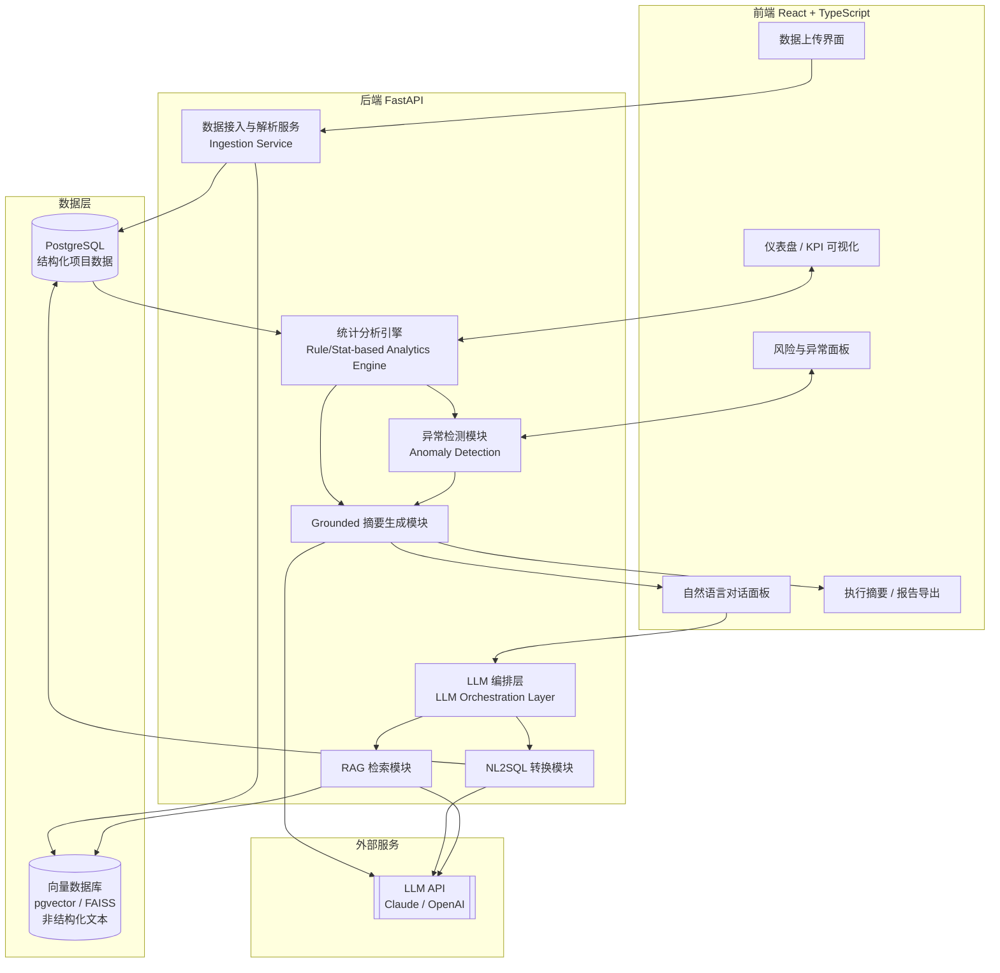
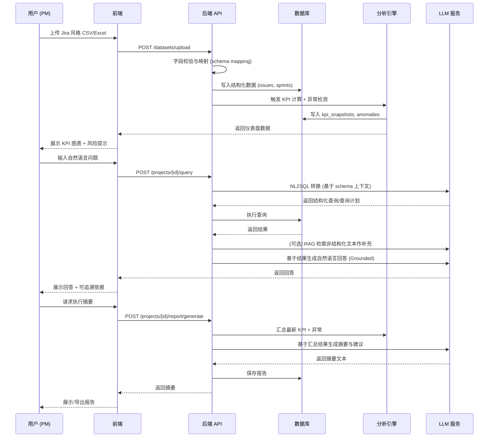

# AI 驱动的敏捷项目决策支持平台
## 详细项目需求文档（系统需求规格 + 全链路闭环设计）

| 项目 | 内容 |
|---|---|
| 文档版本 | v1.0 |
| 日期 | 2026年7月 |
| 配套文档 | PRD.md（产品需求文档） |
| 技术栈 | React (TypeScript) + FastAPI + PostgreSQL + LLM API (RAG/NL2SQL) |

---

## 1. 文档说明与范围

本文档是 PRD 的技术落地版本，面向"如何构建"，重点交付三件事：
1. 一条完整、可演示的 **端到端业务闭环**（Closed-loop Pipeline）；
2. 可直接转化为开发任务的 **功能需求规格（FR）**；
3. 支撑 First Class 评分的 **技术架构设计** 与 **评估方案**。

---

## 2. 系统总体架构



**架构核心思想（技术贡献点）：** 系统分为两条并行且相互衔接的技术路线：
- **确定性路线（Deterministic Track）：** 统计分析引擎 + 异常检测模块，输出的是可复现、可验证的事实（KPI 数值、异常标记）；
- **生成式路线（Generative Track）：** LLM 编排层负责将确定性路线的结果"翻译"为自然语言，并支持自然语言查询和检索问答。

LLM **不直接访问原始数据表**，而是访问确定性路线预先计算好的结构化结果（KPI JSON、异常列表），从而实现 Grounded Generation，这是本项目区别于"简单调用 GPT 分析 CSV"的核心工程设计，也是论文实验对比的基础（第 9 节）。

---

## 3. 端到端业务闭环（Closed-loop Pipeline）



### 闭环阶段说明

| 阶段 | 输入 | 处理 | 输出 |
|---|---|---|---|
| ① 数据接入 | CSV/Excel 文件 | 字段解析、清洗、类型校验、schema 映射 | 结构化 Issue/Sprint 记录 |
| ② 统计分析 | 结构化记录 | KPI 计算（速度、周期时间等） | KPI 快照 |
| ③ 异常检测 | KPI 快照 + 明细记录 | 统计规则 / 简单模型判定 | 异常列表（含严重度、关联 Issue） |
| ④ 可视化呈现 | KPI + 异常 | 图表渲染、风险高亮 | 交互式仪表盘 |
| ⑤ 自然语言查询 | 用户问题 | NL2SQL / RAG | 结构化答案 + 引用依据 |
| ⑥ 摘要生成 | KPI + 异常 + （可选）检索文本 | Grounded Prompt 构造 → LLM 生成 | 执行摘要与建议 |
| ⑦ 报告导出 | 摘要 + 关键图表 | 格式转换 | PDF/Word 报告 |

这一闭环即为系统的 MVP 验收标准：**从"上传一份数据"到"拿到一份可信、可解释、可导出的决策建议"全程无需人工介入。**

---

## 4. 功能需求详细规格（Functional Requirements）

### 模块 A：数据接入与预处理（Data Ingestion）

| ID | 需求描述 | 优先级 | 验收标准 |
|---|---|---|---|
| FR-A1 | 支持上传 CSV / XLSX 格式的 Jira 风格导出文件 | Must | 上传成功率 100%（对符合 schema 的样例文件） |
| FR-A2 | 自动识别/映射关键字段（Issue Key, Type, Status, Assignee, Story Point, Sprint, Created/Resolved Date 等） | Must | 缺失关键字段时给出明确错误提示 |
| FR-A3 | 数据清洗（空值处理、日期格式标准化、异常字符处理） | Must | 清洗后数据无解析报错 |
| FR-A4 | 提供合成数据生成器，用于演示与测试 | Should | 一键生成可配置规模/异常比例的 Jira 风格数据集 |

### 模块 B：统计分析引擎（Deterministic Analytics）

| ID | 需求描述 | 优先级 | 验收标准 |
|---|---|---|---|
| FR-B1 | 计算 Sprint 速度（Velocity） | Must | 与手工计算结果一致 |
| FR-B2 | 计算燃尽/燃起趋势（Burndown/Burnup） | Must | 图表数据点与源数据一致 |
| FR-B3 | 计算周期时间（Cycle Time）与前置时间（Lead Time） | Must | 抽样验证误差 ＜1% |
| FR-B4 | 计算缺陷密度 / Bug 占比 | Must | 与手工统计一致 |
| FR-B5 | 计算范围蔓延（Scope Creep）比例 | Should | — |
| FR-B6 | 计算团队成员工作量分布 | Should | — |

### 模块 C：异常检测（Anomaly Detection）

| ID | 需求描述 | 优先级 | 验收标准 |
|---|---|---|---|
| FR-C1 | 基于 Z-score/IQR 检测速度骤降异常 | Must | 在合成异常数据集上 Recall ＞0.7 |
| FR-C2 | 检测任务延期堆积（逾期未关闭比例超阈值） | Must | — |
| FR-C3 | 检测阻塞任务（Blocked）异常堆积 | Must | — |
| FR-C4 | 检测估算偏差（Story Point vs 实际耗时）异常 | Should | — |
| FR-C5 | （可选）引入 Isolation Forest 做多变量联合异常检测，作为规则方法的对比/补充 | Could | 与规则方法结果对比分析写入论文 |

### 模块 D：LLM 智能分析层

| ID | 需求描述 | 优先级 | 验收标准 |
|---|---|---|---|
| FR-D1 | NL2SQL：将自然语言问题转换为可执行查询，仅作用于结构化字段 | Must | 预设问题集执行准确率 ＞80% |
| FR-D2 | Grounded 摘要生成：基于 KPI + 异常结果生成执行摘要，禁止模型引用未提供的数字 | Must | 人工抽查摘要中的数字均可追溯至源数据 |
| FR-D3 | 管理建议生成：基于摘要进一步给出可执行建议（如"建议关注 X 成员的工作量"） | Must | — |
| FR-D4 | RAG 问答：基于 Issue 描述/评论构建向量索引，支持"为什么"类开放性问题 | Should | 检索 Top-K 命中相关文本的人工评估准确率 ＞70% |
| FR-D5 | 对比实验开关：支持"朴素 Prompt（直接喂原始数据）"与"Grounded Prompt"两种模式切换，用于实验对比 | Should | 可在同一数据集上输出两种模式结果供对比 |

### 模块 E：仪表盘与可视化

| ID | 需求描述 | 优先级 | 验收标准 |
|---|---|---|---|
| FR-E1 | 展示核心 KPI 卡片（速度、周期时间、缺陷率等） | Must | — |
| FR-E2 | 展示燃尽图、速度趋势图 | Must | — |
| FR-E3 | 异常/风险高亮列表，点击可查看关联 Issue | Must | — |
| FR-E4 | 图表交互（悬浮提示、时间范围筛选） | Should | — |

### 模块 F：对话与报告

| ID | 需求描述 | 优先级 | 验收标准 |
|---|---|---|---|
| FR-F1 | 自然语言对话面板，支持连续追问 | Must | — |
| FR-F2 | 回答附带可追溯依据（引用了哪些 KPI/Issue） | Must | — |
| FR-F3 | 执行摘要一键生成与展示 | Must | — |
| FR-F4 | 报告导出为 PDF/Word | Should | — |

### 模块 G：账号与项目管理（最小化实现）

| ID | 需求描述 | 优先级 | 验收标准 |
|---|---|---|---|
| FR-G1 | 简单单用户会话管理（无需完整多角色权限体系） | Should | — |
| FR-G2 | 支持保存多个历史上传的项目数据集 | Could | — |

---

## 5. 技术架构详细设计

### 5.1 前端（React + TypeScript）
- 状态管理：React Query（用于服务端状态/缓存）+ 轻量本地状态（Zustand 或 Context）
- 图表库：Recharts 或 ECharts，用于 KPI 趋势图、燃尽图
- 关键页面：数据上传页、仪表盘页、风险面板、对话面板、报告页

### 5.2 后端（FastAPI）
- 分层结构：`api/`（路由）、`services/`（业务逻辑：ingestion, analytics, anomaly, llm）、`models/`（ORM）、`schemas/`（Pydantic 校验）
- 异步任务：大文件解析/KPI 计算使用后台任务（FastAPI BackgroundTasks，数据规模扩大后可替换为 Celery + Redis 队列）
- ORM：SQLAlchemy + Alembic 做数据库迁移

### 5.3 数据库设计（PostgreSQL，关键表）

| 表名 | 关键字段 | 说明 |
|---|---|---|
| `projects` | id, name, created_at | 项目基本信息 |
| `sprints` | id, project_id, name, start_date, end_date | Sprint 信息 |
| `issues` | id, project_id, sprint_id, issue_type, status, assignee, story_points, priority, created_date, resolved_date, due_date, description, comments | 核心事实表 |
| `kpi_snapshots` | id, project_id, sprint_id, metric_name, value, computed_at | 计算结果缓存 |
| `anomalies` | id, project_id, sprint_id, type, severity, description, related_issue_ids, detected_at | 异常记录 |
| `query_logs` | id, project_id, question, generated_query, answer, created_at | NL 查询日志（也用于评估阶段的准确率统计） |
| `reports` | id, project_id, summary_text, recommendations, generated_at | 生成的执行摘要 |

### 5.4 LLM 集成架构（技术贡献核心）

**双引擎设计：**

1. **NL2SQL 引擎**
   - 输入：用户自然语言问题 + 数据库 schema 描述（表结构、字段含义、取值范围）
   - Prompt 策略：Few-shot 示例 + schema-aware 约束（限制只能生成 SELECT 语句、禁止跨表危险操作）
   - 输出：结构化查询 → 后端执行 → 将结果连同原问题一起交给 LLM 生成自然语言回答

2. **RAG 引擎（针对非结构化文本，如 Issue 描述/评论）**
   - 索引构建：对 `issues.description` / `comments` 做向量化（embedding）存入 pgvector
   - 检索：Top-K 相似片段检索
   - 生成：检索结果作为上下文，与结构化查询结果共同构成 LLM 的输入依据

3. **Grounded Summary Generation（核心实验对比点）**
   - **基线方案（Naive Prompting）：** 将原始数据样本直接放入 Prompt，让 LLM"自由分析"
   - **改进方案（Grounded Prompting）：** 仅将 ② 统计分析引擎和 ③ 异常检测模块计算好的结构化结果（JSON）放入 Prompt，明确指令"只能基于给定数值生成结论，不得编造未提供的数字"
   - 两种方案在相同数据集上生成的摘要将在第 9 节评估方案中做对比实验，衡量事实一致性/幻觉率差异——**这是本项目最具"研究贡献"性质的部分，建议作为论文核心实验章节。**

### 5.5 API 设计一览

| 方法 | 路径 | 说明 |
|---|---|---|
| POST | `/api/datasets/upload` | 上传数据文件并触发解析 |
| GET | `/api/projects/{id}/dashboard` | 获取仪表盘所需 KPI 数据 |
| GET | `/api/projects/{id}/anomalies` | 获取异常列表 |
| POST | `/api/projects/{id}/query` | 自然语言查询（NL2SQL + 可选 RAG） |
| POST | `/api/projects/{id}/report/generate` | 生成执行摘要与建议 |
| GET | `/api/projects/{id}/report/{report_id}` | 获取指定报告 |
| GET | `/api/projects/{id}/report/{report_id}/export` | 导出 PDF/Word |

---

## 6. 数据需求

### 6.1 数据来源
1. **公开数据集：** Kaggle 上的项目管理/敏捷开发数据集（用于真实性验证）
2. **合成数据生成器（自建，FR-A4）：** 可配置团队规模、Sprint 数量、异常注入比例，用于：
   - 演示系统功能
   - 构造有 ground truth 的异常检测评估集（第 9.1 节）

### 6.2 核心字段规范（Jira 风格 Schema）

```
Issue Key, Issue Type, Status, Assignee, Reporter, Priority,
Story Points, Sprint, Created Date, Resolved Date, Due Date,
Labels, Epic Link, Original Estimate, Time Spent, Description, Comments
```

### 6.3 数据规模假设
- 单项目：500–5,000 条 Issue，5–20 个 Sprint，用于验证性能与可用性边界

---

## 7. 非功能性需求详细

| 类别 | 具体要求 |
|---|---|
| 性能 | 5,000 条 Issue 规模下，KPI 计算 + 异常检测总耗时 ＜5 秒；NL2SQL 单次响应 ＜5 秒（不含极端复杂问题） |
| 可扩展性 | 分析引擎与 LLM 编排层解耦，便于后续替换/新增异常检测算法而不影响其他模块 |
| 安全性 | API 层做输入校验，防止 NL2SQL 生成的查询语句造成注入风险（白名单语句类型 + 只读数据库连接） |
| 容错性 | LLM API 调用失败时提供降级方案（展示原始 KPI/异常列表，不阻塞核心仪表盘功能） |
| 可测试性 | 分析引擎、异常检测模块需有独立单元测试，与 LLM 层解耦以便测试 |

---

## 8. 评估方案设计（Evaluation Plan）

### 8.1 定量评估

| 评估对象 | 方法 | 指标 |
|---|---|---|
| 异常检测 | 在合成数据中按已知比例注入延期/速度骤降等异常，检测算法结果与 ground truth 对比 | Precision / Recall / F1 |
| NL2SQL | 预先构造 30-50 条覆盖不同复杂度的自然语言问题集，人工标注期望答案 | 查询执行成功率、答案准确率 |
| Grounded vs Naive 摘要对比 | 在相同数据集上分别用两种 Prompt 策略生成摘要，人工/LLM-judge 评估摘要中每条陈述是否可追溯到源数据 | 事实一致性得分、幻觉率（Hallucination Rate） |
| 系统性能 | 不同数据规模下测量端到端响应时间 | 响应延迟（p50/p95） |

### 8.2 定性评估（用户测试）

- **参与者：** 5-10 人，优先招募具有项目管理/软件开发相关经验的同学或熟人
- **测试方式：** 任务导向型可用性测试（Task-based Usability Testing）+ Think-aloud
- **核心测试任务：**
  1. 上传一份示例数据集
  2. 从仪表盘中找出本 Sprint 存在的风险
  3. 用自然语言提出一个关于团队工作量的问题
  4. 阅读并评价生成的执行摘要是否可信、是否可直接使用
- **量化问卷：** System Usability Scale（SUS，10 题标准问卷）
- **质性反馈：** 半结构化访谈，收集对"可信度""可解释性""实用性"的主观评价，用于论文 Discussion 章节的深入分析

### 8.3 伦理审批说明
用户测试涉及人类参与者，需在测试开始前完成学院低风险伦理自评（Ethics Self-Assessment Form），获得知情同意后方可开展。

---

## 9. 测试计划

| 测试类型 | 覆盖范围 | 工具/方法 |
|---|---|---|
| 单元测试 | KPI 计算函数、异常检测规则函数 | pytest |
| 集成测试 | 上传 → 解析 → 存库 → 计算 → 返回仪表盘数据 全链路 | pytest + 测试数据库 |
| API 测试 | 各 REST 接口的请求/响应校验 | pytest + httpx |
| 实验性评估测试 | 见第 8 节 | 自建评估脚本 + 人工标注 |
| 端到端演示测试 | 完整闭环演示脚本（用于答辩/演示） | 手动 + Playwright（可选） |

---

## 10. 实施计划与里程碑（与 PRD 时间线对齐）

| 阶段 | 交付物 | 对应 PRD 优先级 |
|---|---|---|
| Sprint 1（Week 7-10） | 数据上传、字段解析、KPI 计算、基础仪表盘 | Must-have 核心闭环第一部分 |
| Sprint 2（Week 11-14） | 异常检测模块、Grounded 摘要生成 | Must-have 核心闭环第二部分 |
| Sprint 3（Week 15-17） | NL2SQL 查询、RAG 问答（Should） | Must + Should |
| 评估阶段（Week 18-20） | 定量实验、用户测试、SUS 数据收集 | 支撑论文 Evaluation 章节 |
| 收尾阶段（Week 21-24） | 报告导出功能打磨、论文撰写、演示准备 | Should/Could + 论文交付 |

---

## 11. 风险管理表

| 风险 | 可能性 | 影响 | 应对措施 |
|---|---|---|---|
| LLM API 成本超支 | 中 | 中 | 设置调用配额、开发/测试阶段使用小规模数据+缓存结果 |
| NL2SQL 对复杂问题准确率不足 | 高 | 中 | 限定 MVP 支持的问题类型范围，超出范围给出友好提示而非错误答案 |
| 用户测试招募不足 5 人 | 中 | 高（影响评估章节说服力） | 提前 4-6 周开始招募，必要时降低样本量但需在论文中明确说明局限性 |
| 时间不足导致 RAG 模块未完成 | 中 | 低 | RAG 为 Should-have，可降级为 Could-have，不影响核心闭环与及格线 |
| 异常检测规则过于简单缺乏"技术深度" | 中 | 高 | 补充 Isolation Forest 等模型作为对比方法，形成方法论对比小节 |

---

## 12. 与论文章节映射表

| 需求文档章节 | 对应论文章节 | 建议篇幅占比（10,000 字总量参考） |
|---|---|---|
| 1-3 系统架构与闭环设计 | System Design & Architecture | ~20% |
| 4 功能需求 | Requirements Analysis（可与 PRD 部分合并） | ~10% |
| 5 技术架构（尤其 5.4 LLM 双引擎设计） | Implementation（核心技术章节） | ~25% |
| 6-7 数据与非功能需求 | Implementation / Methodology | ~10% |
| 8 评估方案与结果 | Evaluation & Results | ~20% |
| 11 风险与限制 | Discussion & Limitations | ~10% |
| — | Conclusion & Future Work | ~5% |

> 建议将 **5.4 节的 Grounded vs Naive Prompting 对比实验** 作为论文的核心亮点章节展开，这是最能体现"工程贡献 + 可量化评估"、最有机会冲击 70+ 的部分。
